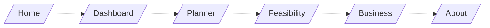

**AresMatrix LEO**

Neon-dark Next.js 15 platform combining CesiumJS visualization, NASA GIBS imagery, and an AI‑powered Feasibility Advisor using a local Llama3 (Ollama) model.

## Platform Flow



## ✨ Features

- CesiumJS globe for LEO situational awareness and TLE‑based proximity checks.
- Mission Planner: launch site suggestions, debris risk banding, simple lifetime estimates, and mitigations.
- EO Previews: NASA GIBS WMTS/WMS snapshots via proxy for quick visualization.
- Feasibility Advisor: commercialization guidance with partner ecosystem context; runs privately on your machine.
- Business and About pages with a curated Partner Ecosystem.
- Optional GitHub OAuth via NextAuth.

## 🔭 Use Cases

- Planner sanity checks: pick suitable launch sites by inclination, estimate lifetime vs. area‑to‑mass, and list mitigations.
- Feasibility vetting: assess commercial payload fit, partner alignment, and timelines.
- Rapid EO visualization: preview NASA GIBS layers to inform site selection and risk.
- Alert monitoring: watch conjunctions, debris bands, and operational advisories.

## 🧱 Tech Stack

- Next.js 15, React 19, TypeScript 5
- CesiumJS, Three.js, satellite.js
- Tailwind CSS 4
- NextAuth (GitHub provider)

## 📂 Project Structure

```text
orbitguard/
├── README.md
├── next.config.ts
├── package.json
├── public/
│   ├── cesium/              # Cesium static assets and workers
│   ├── globe.svg
│   └── ...
├── src/
│   ├── app/
│   │   ├── page.tsx         # Home
│   │   ├── layout.tsx       # Global layout & metadata
│   │   ├── dashboard/page.tsx
│   │   ├── planner/page.tsx
│   │   ├── feasibility/page.tsx
│   │   ├── business/page.tsx
│   │   ├── about/page.tsx
│   │   ├── resources/
│   │   │   ├── page.tsx
│   │   │   ├── earth-observation/page.tsx
│   │   │   ├── data/page.tsx
│   │   │   └── debris/page.tsx
│   │   └── api/
│   │       ├── feasibility/route.ts
│   │       ├── planner/route.ts
│   │       ├── alerts/route.ts
│   │       ├── gibs/route.ts
│   │       └── auth/[...nextauth]/route.ts
│   └── components/
│       ├── NavBar.tsx
│       ├── Footer.tsx
│       ├── AnimatedHero.tsx
│       ├── FeasibilityForm.tsx
│       └── ...
└── tsconfig.json
```

## ⚙️ Setup & Development

1) Install dependencies and run dev

```bash
npm install
npm run dev
# open http://localhost:3000
```

2) Configure environment

Create `.env.local` in the project root (same folder as `package.json`):

```env
OLLAMA_URL=http://localhost:11434
OLLAMA_MODEL=llama3
NEXTAUTH_SECRET=replace-with-a-random-string
GITHUB_ID=your-github-client-id
GITHUB_SECRET=your-github-client-secret
```

3) Set up local model server (Ollama)

```bash
brew install ollama
ollama serve
ollama pull llama3
```

4) Build and start (production)

```bash
npm run build
npm run start
```

## 🧩 Feasibility Advisor

- Page: `src/app/feasibility/page.tsx`
- Form: `src/components/FeasibilityForm.tsx`
- API: `src/app/api/feasibility/route.ts`

How it works
- Collects mission inputs (purpose, budget, altitude, payload, timeline, risk tolerance).
- Builds a commercialization prompt with near‑term options and partner ecosystem examples (PNT, EO, ground, comms, launch, analytics).
- Sends the prompt to your local server and returns a structured plan.
- Supports `model` override in the request body, otherwise uses `OLLAMA_MODEL`.

UI details
- Uses UI library icons (`lucide-react`) across inputs and actions.
- Displays the advisor response in a chat‑style bubble with an “Advisor” icon.
- Submit button shows a send icon and a spinning loader during analysis.

Example curl

```bash
curl -X POST http://localhost:3000/api/feasibility \
  -H "Content-Type: application/json" \
  -d '{
    "purpose":"EO startup",
    "budget":"25",
    "altitude":"550",
    "payload":"60",
    "timeline":"18",
    "riskTolerance":"Moderate",
    "model":"llama3"
  }'
```

## 🛰️ API Reference

### POST `/api/feasibility`
- Body: `{ purpose, budget, altitude, payload, timeline, riskTolerance, model? }`
- Returns: `{ result: string }`

### POST `/api/planner`
- Body: `{ siteLat, siteLon, altitudeKm, inclinationDeg, massKg, areaM2 }`
- Returns: `{ recommendedSite, debrisRisk, lifetimeYears, recommendations }`

### GET `/api/alerts`
- Returns: `{ count: number, alerts: { a: string, b: string, distance_km: number }[] }`

### GET `/api/gibs`
- WMTS and WMS proxy for NASA GIBS imagery.
- Query: `layer` (required), `time`, `wms` (flag), `width`, `height`, `bbox` for WMS. For WMTS: `tileMatrixSet`, `tileMatrix`, `tileRow`, `tileCol`.
- Returns: `image/jpeg` tiles or snapshots.

## 🔐 Security & Privacy

- Feasibility Advisor runs locally; no mission inputs are sent to external services.
- OAuth (if enabled) uses GitHub; store secrets in `.env.local` and do not commit them.
- Static Cesium assets are served from `public/cesium/`.

## 🧭 Troubleshooting

- Local model unreachable: ensure `ollama serve` is running, `ollama pull llama3`, and `OLLAMA_URL` is set.
- Cesium widget CSS warnings (e.g., `InfoBoxDescription.css`): functionality remains normal; verify widget CSS assets if desired.
- External API rate limits: CelesTrak/GIBS may be slow or limited; retry or reduce request frequency.

## 🧠 Roadmap

- Provider switch for remote inference (config‑driven).
- Persist UI preferences (expanded views, last‑used layers).
- Screenshot gallery for Dashboard, Feasibility, and Business.
- Expanded Partner Ecosystem with brief descriptions and links.

## 🪐 About

AresMatrix LEO focuses on sustainability in the LEO economy: better visualization, safer planning, and grounded commercialization paths. The neon‑dark UI reinforces clarity without noise.

—

Developed with ⚡ Next.js + Cesium + Llama3 © 2025 AresMatrix LEO Project

## Use Cases

- Conjunction awareness: monitor a small active set for potential close approaches and visualize on a globe.
- Mission feasibility: quickly assess orbit strategy, ROI ranges, and relevant partners for near‑term commercialization.
- Planner sanity checks: pick suitable launch sites by inclination, estimate lifetime vs. area‑to‑mass, and list mitigations.
- EO previews: view daily imagery layers quickly without building a full tiling stack.

## Architecture Overview

- Client pages under `src/app/*` render UI (Home, Dashboard, Planner, Feasibility, Resources, Business, About).
- API routes under `src/app/api/*` provide data and computations:
  - `alerts`: fetches TLEs and computes distances between a subset of satellites.
  - `planner`: derives site recommendation, debris band risk, and lifetime estimate.
  - `gibs`: proxies GIBS WMTS/WMS for simple image previews.
  - `feasibility`: sends a planning prompt to your local inference server and returns text.
  - `auth`: optional GitHub OAuth via NextAuth.
- Cesium assets live in `public/cesium/` and are served statically.
- Styling is Tailwind CSS; some components use simple glass and neon classes for a dark theme.

## API Reference

### POST `/api/feasibility`
- Request body:
  - `purpose` string, `budget` string, `altitude` string, `payload` string, `timeline` string, `riskTolerance` string
  - `model` string (optional; overrides default)
- Response:
  - `{ result: string }` — commercialization plan text
- Example:
  - `curl -X POST http://localhost:3000/api/feasibility -H "Content-Type: application/json" -d '{"purpose":"EO startup","budget":"25","altitude":"550","payload":"60","timeline":"18","riskTolerance":"Moderate","model":"llama3"}'`

### POST `/api/planner`
- Request body:
  - `{ siteLat: number, siteLon: number, altitudeKm: number, inclinationDeg: number, massKg: number, areaM2: number }`
- Response:
  - `{ recommendedSite, debrisRisk, lifetimeYears, recommendations }`
  - `recommendedSite`: `{ name, lat, lon }`
  - `debrisRisk`: `{ level: "low" | "moderate" | "high", rationale: string[] }`
  - `lifetimeYears`: `{ years: number, complies25yrRule: boolean }`

### GET `/api/alerts`
- Response:
  - `{ count: number, alerts: { a: string, b: string, distance_km: number }[] }`
  - Alerts list small close‑approach pairs within the sampled subset.

### GET `/api/gibs`
- Query parameters:
  - `layer` (required), `time` (ISO date), `wms` (flag), `width`, `height`, `bbox` for WMS preview
  - For WMTS: `tileMatrixSet`, `tileMatrix`, `tileRow`, `tileCol`
- Returns `image/jpeg` tiles/snapshots from NASA GIBS.

## Security & Privacy

- Feasibility Advisor runs entirely on your machine using your configured local server.
- No mission inputs are persisted; they are POSTed and returned in‑memory for the session.
- OAuth (if enabled) uses GitHub; store secrets in `.env.local` and avoid committing them.

## Troubleshooting

- Local model not responding:
  - Ensure `ollama serve` is running and the model exists: `ollama list` then `ollama pull llama3`.
  - Verify `OLLAMA_URL` and `OLLAMA_MODEL` in `.env.local` and restart `npm run dev`.
- Cesium widget CSS warning:
  - If you see a missing `InfoBoxDescription.css` message, verify widget CSS assets are available. Globe interaction should still work.
- External API issues:
  - CelesTrak/GIBS may rate‑limit or respond slowly; try again or reduce requests in demos.

## Roadmap

- Add a provider switch for remote inference (config‑driven).
- Persist user preferences (expanded views, last‑used layers).
- Add screenshots and short demos to this README.
- Expand partner ecosystem categories with brief descriptions and links.
